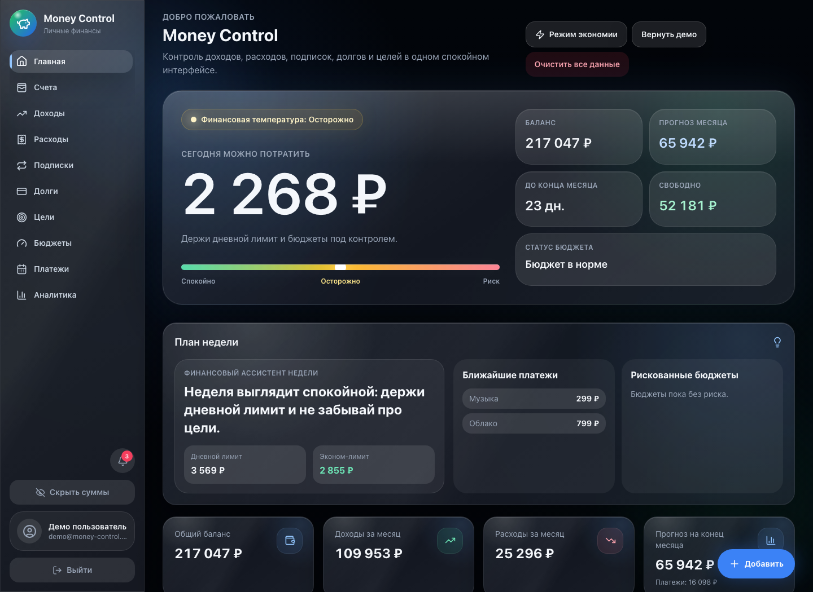
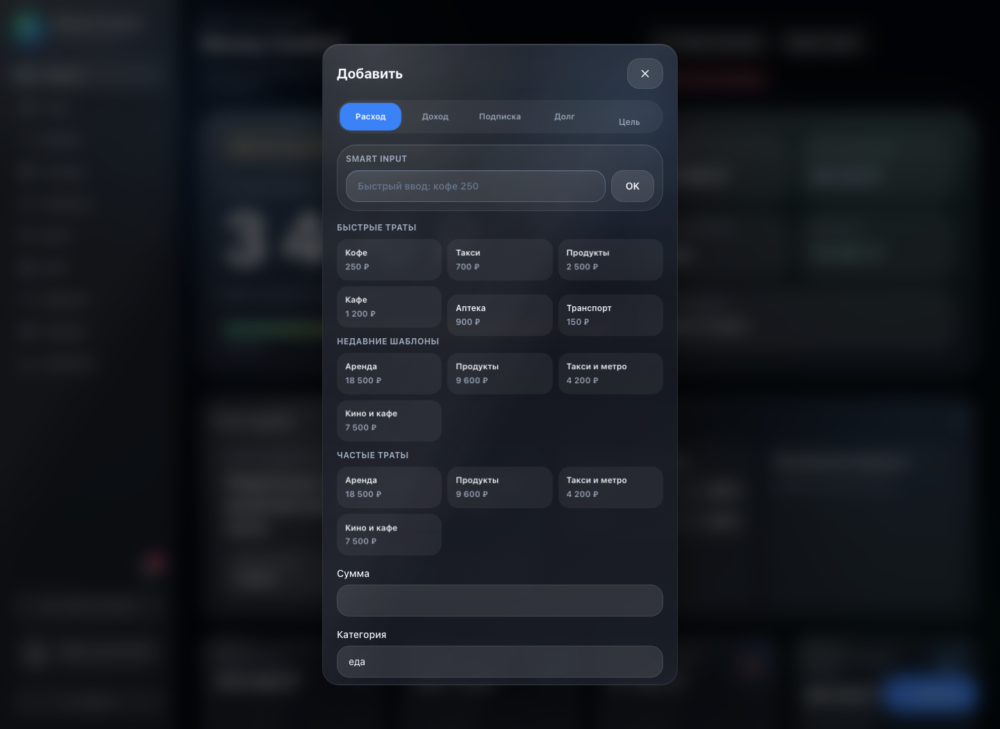
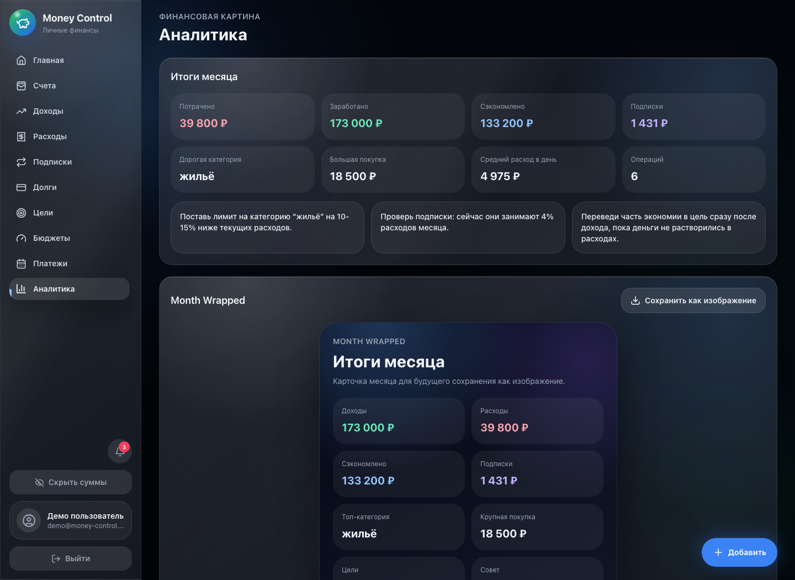
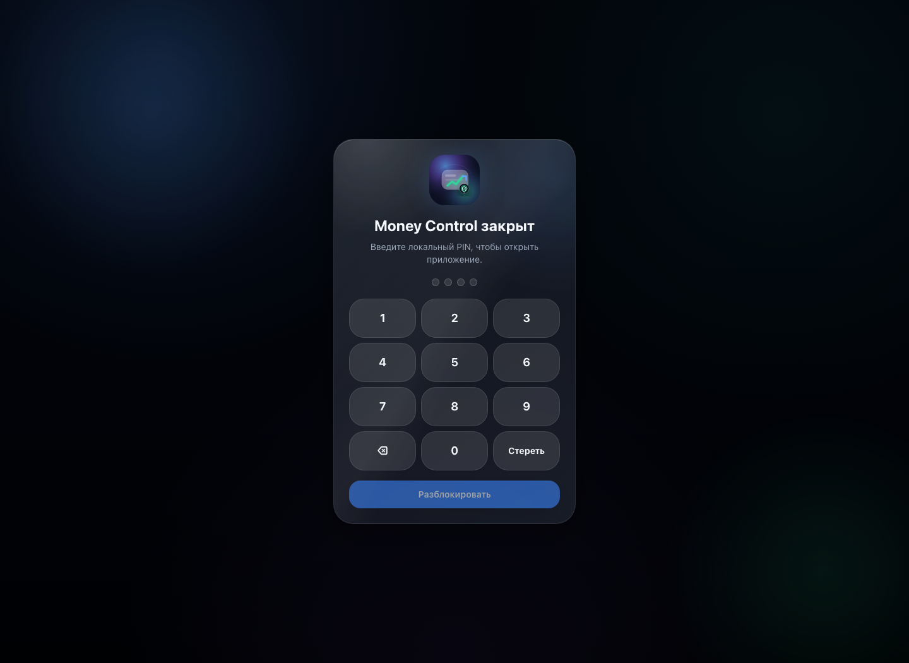
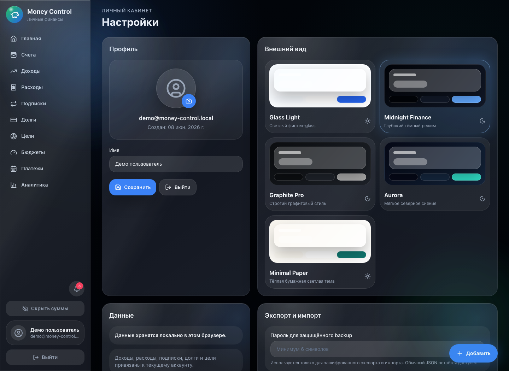

# Money Control

Premium local-first приложение для контроля личных финансов. Money Control помогает каждый день понимать, сколько можно тратить, куда уходят деньги, какие платежи впереди и как быстро растут цели накоплений.

Демо: https://chmutovia-jpg.github.io/money-control/

## Screenshots












## Product Highlights

- Dashboard с hero-карточкой “Сегодня можно потратить”.
- Финансовая температура, план недели, Smart Alerts и режим “Экономия”.
- Доходы, расходы, счета, бюджеты, подписки, долги и цели накоплений.
- Recurring transactions и cashflow-календарь.
- Quick Add с быстрым вводом: `кофе 250`, `такси 700`, `аптека 1200`.
- Аналитика, сравнение месяцев и Month Wrapped.
- Экспорт Month Wrapped как изображение.
- JSON/CSV экспорт, импорт с проверкой дублей и защищённый backup с паролем.
- PWA с app icon, manifest, shortcuts и service worker.
- Локальный PIN-lock, скрытие сумм и темы.

## Security / Local-first

Money Control — local-first приложение. Данные хранятся в `localStorage` текущего браузера и не уходят на сервер. Это не облачный банковский аккаунт и не синхронизация между устройствами. Для переноса данных используй JSON backup.

Пароль и PIN локального профиля сохраняются как `hash + salt`. Защищённый backup шифруется паролем через Web Crypto API.

## Tech Stack

- React
- Vite
- TypeScript
- Tailwind CSS
- Framer Motion
- Recharts
- html-to-image
- Vitest
- Playwright
- Lighthouse CI
- PWA service worker
- localStorage

## Run Locally

```bash
npm install
npm run dev
```

Обычно Vite откроет приложение на `http://localhost:5173/`.

## Build

```bash
npm run build
```

## Tests

Unit/integration расчёты:

```bash
npm test
```

E2E smoke-тесты:

```bash
npm run test:e2e
```

Lighthouse report:

```bash
npm run build
npm run lighthouse
```

## Deploy To GitHub Pages

Проект использует `base: "./"` в `vite.config.ts`, поэтому GitHub Pages работает из подпапки репозитория.

Деплой настроен через `.github/workflows/deploy.yml`:

```bash
git add .
git commit -m "Polish Money Control production"
git push
```

GitHub Actions соберёт `dist` и опубликует Pages artifact.

## LocalStorage Limitations

- Данные привязаны к браузеру и устройству.
- При очистке данных браузера профиль и финансы могут исчезнуть.
- На другом телефоне данные не появятся автоматически.
- Для переноса используй экспорт JSON или защищённый backup.

## Roadmap

- Ручной экран проверки дублей при импорте.
- Экспорт полной аналитики в PDF.
- Виджеты PWA.
- Более точные сценарии прогноза cashflow.
- Опциональная облачная синхронизация, если потребуется настоящий аккаунт.
